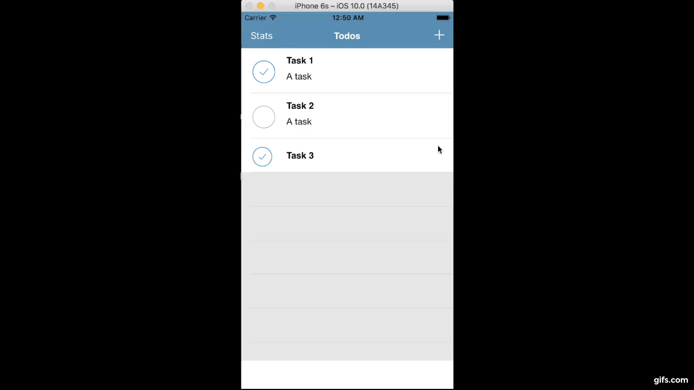

# Project 1: To-Do List App

## Due
Wednesday, October 19 at 11:59 PM

## Description 
In Project 1, you will build your own Utility app - a To-Do List.  As you would
expect, the app is simple. You are able to view your existing tasks, mark a task
as completed, delete a task, add a new task, and view stats about how many tasks
you have completed in 24 hours. As long as your application conforms every one
of our required criteria (see below), you can add whatever additional features,
views, UI, etc. you want. 

By the end of this project, you will have learned how to create a project from
scratch, and work with programmatic design + storyboarding, scaling your
app to multiple views, and certain UIKit elements. 

## Instructions
You are **creating a To-Do List app**. For this project we will not give you any starter code, we want you to start the project by yourself! We want you to fork this repo and push all of your code here. 

## Requirements

You **must** have these three classes, feel free to name them as you please. In addition, you should satisfy the general requirements below. 

###  Table View Controller of To-Do List Items
- [ ] Ability to visually mark a task as completed
- [ ] Ability to visually unmark a task as completed
- [ ] Tasks must automatically clear 24 hours after they are marked as
completed
- [ ] Ability to delete a task
- [ ] Button to add a To-Do Item (goes to Add To-Do Item View)
- [ ] Button to view Stats (goes to Daily Stats View)

###  View Controller of To-Do List Statistics
- [ ] Displays the number of tasks completed in the past 24 hours
- [ ] Ability to return to To-Do List Table View

###  Add To-Do Item View Controller
- [ ] Ability to add a task, where entering text and confirming returns to the
To-Do List Table View, now updated with the new task added
- [ ] Ability to cancel and return to To-Do List Table View without adding a
task

###  General Requirements      
- [ ] Create a Universal app when you construct your Xcode project.
- [ ] UI must scale to iPhone 6 and up and all iPads in both Portrait and
Landscape orientations.
  * Hint: Think Auto-Layout. For UILabels, autoshrink in the Attributes
  Inspector is also useful. 

## Bells & Whistles

1. Make the data persistent, so that when you close the application and reopen
  it, your pre-existing tasks are restored.
2. Make it live up to the iOS design standards (you can submit this app to the App Store).
3. Notifications 
4. Mark all as complete button
5. Any others that you think will impress us!

## Grading

This assignment is hand-graded! If you satisfy all of the requirements you will get full credit. Every requirement missed will have 1 point removed from your total score.

The total score is out of 4, and students with the top submissions are eligible to receive one extra-credit point (5/4). These students have the option to have their resumes referred to Apple University recruiting.

## Example

[Try It](https://appetize.io/app/v6p7rnrnrrwjf1jbwez7uqz13r?device=iphone6s&scale=75&orientation=portrait&osVersion=10.0)

